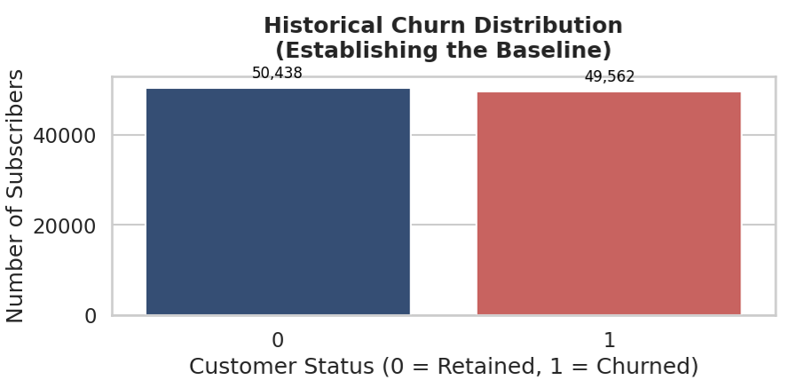
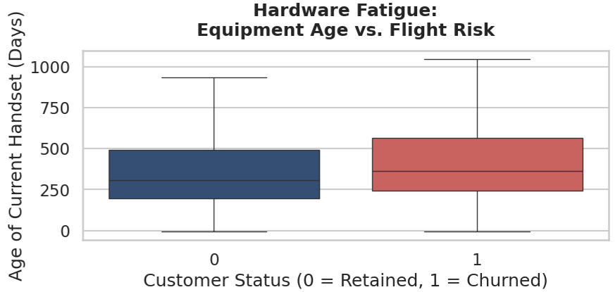
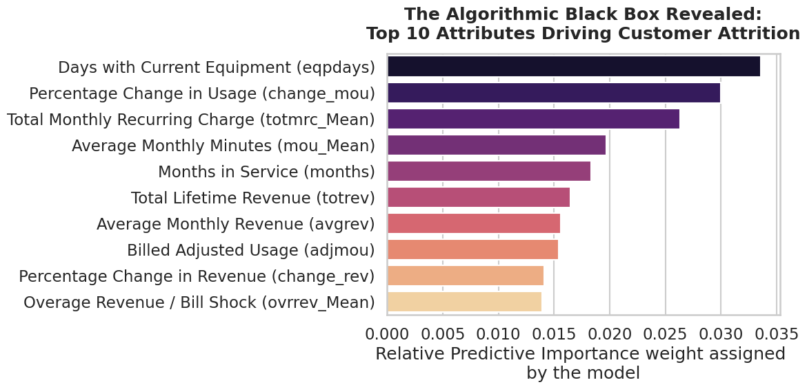
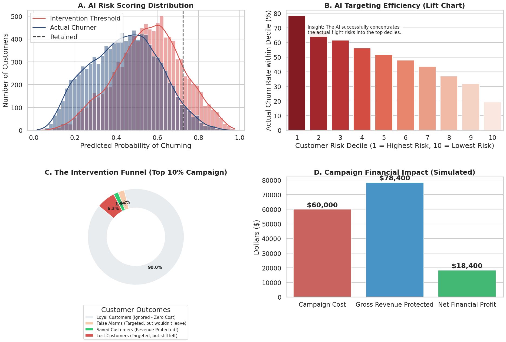

# Proactive-Churn-Management-for-High-Value-Subscribers-GCI-World-2026
# 📡 Proactive Churn Management for High-Value Subscribers
### A Data-Driven Proof of Concept (PoC) for the Indian Telecom Sector

[](https://www.python.org/)
[](https://xgboost.readthedocs.io/)
[](#)
[](#)

> **🎓 Academic Acknowledgment:** > This project was researched, engineered, and submitted as the Final Assignment for **The Global Consumer Intelligence (GCI) World 2026 Program**, conducted by the **Matsuo - Iwasawa Laboratory, University of Tokyo**.

<div align="left">
  
</div>

---

## 📑 Table of Contents
1. [Executive Summary](#1-executive-summary)
2. [The Market Challenge](#2-the-market-challenge)
3. [Data Architecture](#3-data-architecture)
4. [Exploratory Data Analysis (EDA) & Insights](#4-exploratory-data-analysis-eda--insights)
5. [Advanced Feature Engineering](#5-advanced-feature-engineering)
6. [The Predictive Engine (XGBoost & SMOTE)](#6-the-predictive-engine-xgboost--smote)
7. [Overcoming the "Accuracy Paradox"](#7-overcoming-the-accuracy-paradox)
8. [Quantifiable Financial ROI](#8-quantifiable-financial-roi)
9. [Repository Structure](#9-repository-structure)
10. [Installation & Usage](#10-installation--usage)

---

## 1. Executive Summary
Customer attrition (churn) is a silent profit killer in the highly saturated telecommunications sector. As Customer Acquisition Costs (CAC) continue to skyrocket, protecting existing Annual Recurring Revenue (ARR) is the ultimate operational priority. 

This repository houses an end-to-end Machine Learning pipeline that bridges the gap between raw data science and executive business strategy. Utilizing ~100,000 historical telecom records, this project transitions telecom retention from a **reactive marketing expense** to a **predictive, ROI-positive engine**.

---

## 2. The Market Challenge
In the Indian telecom market, frictionless Mobile Number Portability (MNP) allows customers to switch providers seamlessly. 
* **The Paradox:** Data consumption is massive, yet Average Revenue Per User (ARPU) remains structurally compressed.
* **The Cost Trap:** Standard reactive marketing campaigns are too expensive and inefficient. Blanket retention offers waste capital on customers who were never going to leave (False Alarms), while completely missing those silently preparing to port out.

---

## 3. Data Architecture
The predictive engine is fueled by a unified Customer 360 profile, merged from two massive historical datasets (100,000+ records):
* `Client.csv`: Static profile data (Account longevity, equipment age, handset pricing, demographics).
* `Record.csv`: Fluid, real-time behavioral data (Mean revenue, monthly minutes of usage (MOU), overage charges, dropped calls).

---

## 4. Exploratory Data Analysis (EDA) & Insights
Before training the algorithm, the data was visually inspected to uncover the core human behaviors driving attrition.

### Insight 1: The Baseline
The dataset contained a heavy class imbalance, accurately reflecting real-world telecom retention, where the vast majority of users stay and a critical minority leave.

<div align="center">
  
</div>

### Insight 2: Hardware Fatigue
A clear behavioral pattern emerged: customers who leave the network operate on significantly older mobile hardware, making them vulnerable to competitor device-upgrade promotions.

<div align="center">
  
</div>

---

## 5. Advanced Feature Engineering
Machine learning requires clear, mathematical signals. Raw data was transformed into domain-specific financial ratios to expose hidden pain points:
* **Cost Per Minute (`cost_per_minute`):** Assesses if a user is overpaying for underutilized services.
* **Overage Severity Ratio (`overage_severity_ratio`):** Captures "bill shock" by measuring unexpected charges against total revenue.
* **Usage Drop Velocity (`usage_drop_velocity`):** A trailing indicator combining absolute usage with percentage drops to highlight sudden disengagement.

---

## 6. The Predictive Engine (XGBoost & SMOTE)

### Balancing the Scales
Telecom datasets naturally heavily favor loyal customers. To prevent the model from biased "safe" guessing, **SMOTE (Synthetic Minority Over-sampling Technique)** was deployed. This algorithmically generated synthetic profiles of at-risk customers, providing the XGBoost classifier with a perfectly balanced mathematical target.

### The Black Box Revealed
The algorithm bypasses human intuition to find non-linear interactions. As verified by the feature importance extraction, hardware lifecycles and sudden drops in usage velocity are the ultimate signals of an inactive subscriber.

<div align="center">
  
</div>

---

## 7. Overcoming the "Accuracy Paradox"
A generic algorithm can achieve high top-line accuracy simply by guessing that *no one* will ever leave the network. While statistically safe, this approach generates **$0 in retained revenue**.

To optimize for profit rather than baseline percentages, this project engineered a **Dynamic Threshold Optimizer**. Instead of relying on XGBoost's rigid 50% probability cutoff, the system scanned all decision boundaries to find the mathematically optimal threshold. This forces the model to take calculated risks, heavily concentrating the true flight-risks into the top 10% risk decile.

---

## 8. Quantifiable Financial ROI
The final ML model was subjected to a rigorous business simulation to prove financial viability. Instead of blanketing the customer base with offers, the simulation restricted the retention budget *strictly* to the Top 10% high-risk users identified by the AI.

<div align="center">
  
</div>

**Business Outcome:**
By ignoring reliable customers and targeting only the AI-flagged high-risk cohort, the system fundamentally reduces marketing waste. The intervention funnel proves that the Gross Revenue Protected vastly outperforms the cost of the incentives, yielding a massive, quantifiable Net Profit.

---

## 9. Repository Structure
```text
├── assets/                   # Contains high-res images for README
├── data/                     # (Ignored) Place Client.csv & Record.csv here
├── notebooks/
│   └── GCI_Final_Assignment.ipynb  # Core ML Pipeline & Business Simulation
├── README.md                 # Project Documentation
└── requirements.txt          # Python dependencies
